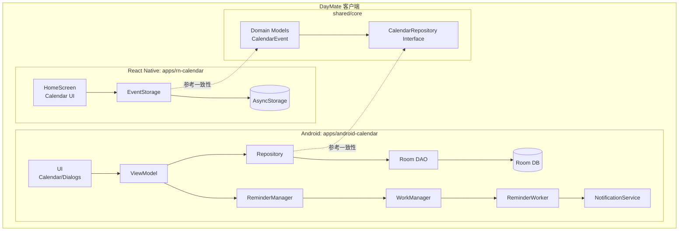

# DayMate 产品报告

日期：2025-12-17

DayMate 是一款跨平台日程管理产品，目标是在 Android 与 React Native 两端提供一致的“查看日历、创建/管理事件、提醒通知”等核心能力，并以可演进的共享业务层（shared/core）承载跨端一致的领域模型与仓库接口。

---

## ① 产品功能介绍

### 1. 日历与日程浏览
- 月视图日历：按天选择日期，查看当天日程列表。
- 日程列表：展示当天所有事件的标题、时间范围、备注等信息。

### 2. 事件管理
- 新建事件：支持填写标题、开始/结束时间、全天、备注/描述、地点、分类、优先级、状态等（Android 端更完整）。
- 编辑事件：更新事件信息后，自动更新提醒计划。
- 删除事件：删除事件并取消对应提醒。

### 3. 提醒通知
- 支持“无提醒 / 5 分钟前 / 15 分钟前 / 30 分钟前 / 1 小时前 / 1 天前”等常见提醒策略。
- 事件到达提醒时间后，向用户发送系统通知，并支持点击通知跳转回应用。

### 4. 本地数据持久化
- Android：基于 Room 的本地数据库存储事件，支持按时间范围查询、分类筛选、搜索等。
- React Native：基于 AsyncStorage 的轻量存储（适合作为 MVP 与原型实现，可按需演进为 SQLite/MMKV）。

---

## ② 程序概要设计

本节给出模块划分、关键数据结构与主要业务流程。

### 1. 模块划分

**Android 应用（apps/android-calendar）**
- UI：日历视图、事件详情/新增编辑弹窗。
- ViewModel：承载 UI 状态与业务编排（新增/编辑/删除事件后触发提醒重算）。
- Repository + DAO：负责事件的增删改查。
- ReminderManager + Worker：负责提醒调度与通知展示。

**React Native 应用（apps/rn-calendar）**
- HomeScreen：月历选择 + 当天日程列表。
- EventStorage：事件持久化与查询。
- 事件模型：CalendarEvent（含 date、title、startTime、endTime、notes 等）。

**共享业务层（shared/core）**
- 领域模型：CalendarEvent。
- 仓库接口：CalendarRepository（create/update/delete/get/search/observe）。
- 目标：提供跨平台一致的业务约束与模型定义，允许未来通过 Native Module 或 KMP 方式让 RN 复用核心逻辑。

### 2. 关键数据结构（概述）

**Android：Event（Room Entity）**
- 核心字段：title、startTime、endTime、allDay、reminderMinutes、category、priority、status 等。

**React Native：CalendarEvent（TypeScript）**
- 核心字段：id、date(yyyy-MM-dd)、title、startTime(HH:mm 可选)、endTime(HH:mm 可选)、notes(可选)。

### 3. 主要业务流程（概述）

**流程 A：新增事件（Android）**
1. 用户在新增/编辑界面填写信息并保存。
2. ViewModel 写入数据库（insert/update）。
3. 保存成功后调用 ReminderManager：
	 - 取消旧提醒（若有）
	 - 根据 startTime 与 reminderMinutes 计算提醒触发时间
	 - 使用 WorkManager 安排 OneTimeWorkRequest

**流程 B：新增日程（React Native）**
1. 用户在 HomeScreen 选择日期。
2. 点击“添加日程”打开表单，填写标题/时间/备注并保存。
3. EventStorage 写入 AsyncStorage。
4. HomeScreen 刷新内存态并更新日历标记点与列表展示。

---

## ③ 软件架构图

> 采用 Mermaid 展示 DayMate 的跨端与模块分层关系。

---

## ④ 技术亮点及其实现原理

### 1) 提醒调度：基于 WorkManager 的可靠通知

**亮点**
- 使用 WorkManager 统一处理延迟任务与系统约束（电量、后台限制等），相对直接使用 AlarmManager 更易维护。
- 调度时先取消旧任务，避免重复提醒。

**实现原理（关键点）**
- 计算提醒触发时间：
	- $T_{remind} = T_{start} - reminderMinutes$
- 计算延迟：
	- $delay = T_{remind} - now$
- 为避免“分钟级向下取整导致 delay=0 立刻触发”的问题，延迟使用毫秒级：
	- `Duration.between(now, reminderTime).toMillis()` + `TimeUnit.MILLISECONDS`

### 2) Android 本地存储：Room + 索引优化查询

**亮点**
- 对 startTime/endTime/category/reminderMinutes 建索引，提升按时间范围、分类、提醒事件等查询性能。

**实现原理**
- Room 基于 SQLite，索引可减少查询扫描范围。
- DAO 以 SQL/注解方式表达查询；Repository 提供更稳定的业务接口。

### 3) 跨端共享业务层的演进路径（shared/core）

**亮点**
- shared/core 提供统一领域模型与仓库接口（CalendarRepository），为未来“跨端一致业务规则”和“复用核心逻辑”预留结构。

**实现原理**
- 以接口定义跨平台能力边界：获取某天/范围事件、创建/更新/删除、按条件搜索、观察事件变化等。
- 当前 Android 侧可对接实际存储实现；React Native 侧可先独立实现，后续可通过 Native Module / KMP 等方式逐步复用。

### 4) React Native 端 MVP：AsyncStorage 快速闭环

**亮点**
- 使用 AsyncStorage 快速实现“新增日程-持久化-刷新展示”的最小闭环，迭代成本低。

**实现原理**
- 将事件按 date 进行分组存储（Key-Value + JSON）：
	- `Record<date, CalendarEvent[]>`
- 保存后同步更新内存态，驱动 UI 立即刷新，并用“日期标记点”提示有日程的日期。

---
